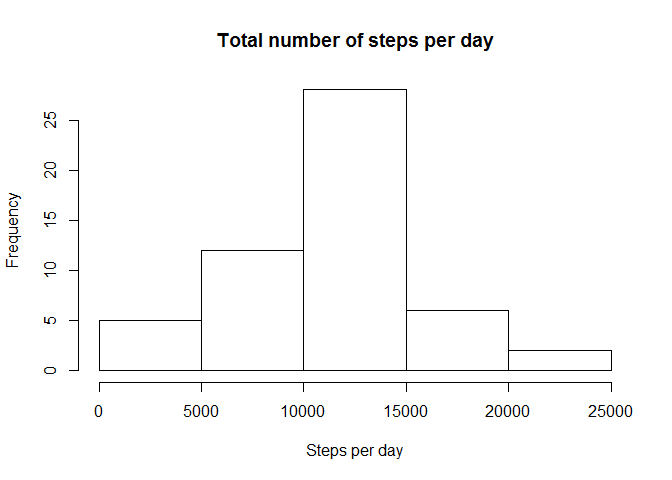
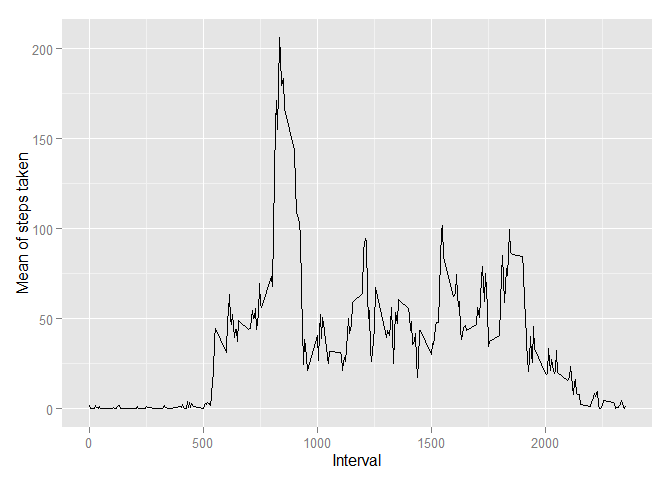
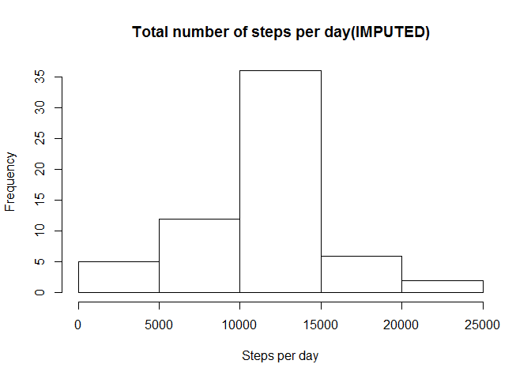
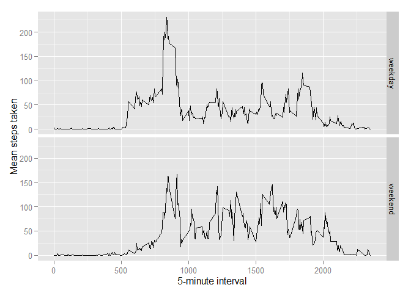

# Reproducible Research: Peer Assessment 1


## Loading and preprocessing the data
This will load the data into 2 dataframes...one with NAs (act_w_NAs) and one with NAs removed(act_wo_NAs).
the date variable will also be converted to a "date" class.


```r
act_w_NAs <- read.csv("activity.csv")
act_wo_NAs <- read.csv("activity.csv")

act_wo_NAs <- act_wo_NAs[complete.cases(act_wo_NAs),]

act_wo_NAs$date <- as.Date(act_wo_NAs$date , "%Y-%m-%d")
act_w_NAs$date <- as.Date(act_w_NAs$date , "%Y-%m-%d")
```

##What is mean total number of steps taken per day?

First lets report the total number of steps per day

```r
steps_tot <- aggregate(steps ~ date, act_wo_NAs, sum)
steps_tot
```

```
##          date steps
## 1  2012-10-02   126
## 2  2012-10-03 11352
## 3  2012-10-04 12116
## 4  2012-10-05 13294
## 5  2012-10-06 15420
## 6  2012-10-07 11015
## 7  2012-10-09 12811
## 8  2012-10-10  9900
## 9  2012-10-11 10304
## 10 2012-10-12 17382
## 11 2012-10-13 12426
## 12 2012-10-14 15098
## 13 2012-10-15 10139
## 14 2012-10-16 15084
## 15 2012-10-17 13452
## 16 2012-10-18 10056
## 17 2012-10-19 11829
## 18 2012-10-20 10395
## 19 2012-10-21  8821
## 20 2012-10-22 13460
## 21 2012-10-23  8918
## 22 2012-10-24  8355
## 23 2012-10-25  2492
## 24 2012-10-26  6778
## 25 2012-10-27 10119
## 26 2012-10-28 11458
## 27 2012-10-29  5018
## 28 2012-10-30  9819
## 29 2012-10-31 15414
## 30 2012-11-02 10600
## 31 2012-11-03 10571
## 32 2012-11-05 10439
## 33 2012-11-06  8334
## 34 2012-11-07 12883
## 35 2012-11-08  3219
## 36 2012-11-11 12608
## 37 2012-11-12 10765
## 38 2012-11-13  7336
## 39 2012-11-15    41
## 40 2012-11-16  5441
## 41 2012-11-17 14339
## 42 2012-11-18 15110
## 43 2012-11-19  8841
## 44 2012-11-20  4472
## 45 2012-11-21 12787
## 46 2012-11-22 20427
## 47 2012-11-23 21194
## 48 2012-11-24 14478
## 49 2012-11-25 11834
## 50 2012-11-26 11162
## 51 2012-11-27 13646
## 52 2012-11-28 10183
## 53 2012-11-29  7047
```
Then we'll create a histogram of the total steps taken each day

```r
hist(steps_tot$steps, main = "Total number of steps per day", xlab = "Steps per day")
```

 
Finally, here's the mean and median of total steps per day

```r
mean(steps_tot$steps)
```

```
## [1] 10766.19
```

```r
median(steps_tot$steps)
```

```
## [1] 10765
```
##What is the average daily activity pattern?
First, I used the function summaryBy (which is found in the DoBy library) to assign the values of the sum and mean to a dataframe called 's3'
To clean up the dataframe a little I renamed (using the rename function found in the plyr library ) the colnames to something more manageable.

```r
s3 <- summaryBy(act_wo_NAs$steps ~ act_wo_NAs$interval, data = act_wo_NAs, 
                FUN = list(mean,sum))
s3 <- rename(s3,c("act_wo_NAs$steps.mean" = "mean"))
s3 <- rename(s3,c("act_wo_NAs$steps.sum" = "sum"))

qplot(as.integer(interval), mean, data=s3,  geom="line", xlab="Interval", ylab = "Mean of steps taken")
```

 

Now that the data has been plotted, which 5-minute interval
contains the maximum number of steps?

```r
s3[which.max(s3$sum),]
```

```
##     interval     mean   sum
## 104      835 206.1698 10927
```

##Imputing missing values
To calculate the number of missing rows, I just used the difference of the nrows of rows in the act_w_NAs dataframe and act_wo_NAs dataframe. The result states that there are 2304 rows with NAs.

```r
nrow(act_w_NAs) - nrow(act_wo_NAs)
```

```
## [1] 2304
```

Now we want to replace those NA values with another value. For this project I just replaced it with the mean for that particular interval. I used the "mean" value from my 's3' table generated by summaryBy. This loops through the rows, finds the row with an NA in it and replaces that value with the value of the mean from the corresponding interval found in 's3'

```r
for (i in 1:nrow(act_w_NAs)) {
  if(is.na(act_w_NAs$steps[i])) {
    m <- s3[which(s3$interval == act_w_NAs$interval[i]),2]
    act_w_NAs$steps[i] <- m 
  }
} 
```
Next I will make a histogram of this altered data frame

```r
steps_tot_1 <- aggregate(steps ~ date, act_w_NAs, sum)

# histogram of steps/day
hist(steps_tot_1$steps, main = "Total number of steps per day(IMPUTED)", xlab = "Steps per day")
```

 


And finally, here are the meas and medians of the altered data frame.

```r
mean(steps_tot_1$steps)
```

```
## [1] 10766.19
```

```r
median(steps_tot_1$steps,na.rm = TRUE)
```

```
## [1] 10766.19
```
By replacing the NAs with the mean, we observed no signaficant change in the estimates

##Are there differences in activity patterns between weekdays and weekends?

First, we will create a new factor variable called "dayType" and assign to it the value of "weekend" or "weekday" , dependant on the value of the "date" field. This new factor will be a variable in a new data frame called "final_df".

'''{r}
weekend <- c("Saturday", "Sunday")

final_df <- act_w_NAs
final_df$dayType <- ifelse(weekdays(final_df$date) %in% weekend, "weekend", "weekday")
'''

To create my time series plot, I created two data frames called wday (for weekdays) and wknd(for weekends) whcih were created with the results of the mean by interval from the function "aggregate". Next I used rbind to merge them togther to create a new data frame called "w"


```r
wknd <- aggregate(final_df[which(final_df$dayType == "weekend"),1] ~ final_df[which(final_df$dayType == "weekend"),3], final_df, mean)
wday <-  aggregate(final_df[which(final_df$dayType == "weekday"),1] ~ final_df[which(final_df$dayType == "weekday"),3], final_df, mean)

colnames(wknd)[1] <- "interval"
colnames(wknd)[2] <- "mean"
wknd$dayType <- "weekend"
colnames(wday)[1] <- "interval"
colnames(wday)[2] <- "mean"
wday$dayType <- "weekday"

w <- rbind(wday,wknd)
```
Finally, using ggplot, I created two plots (one for weekend and the other for weekday) of the mean steps taken by interval.


```r
 ggplot(w, aes(interval, mean)) + geom_line() + facet_grid(dayType ~ .) + 
  xlab("5-minute interval") + ylab("Mean steps taken")
```

 
